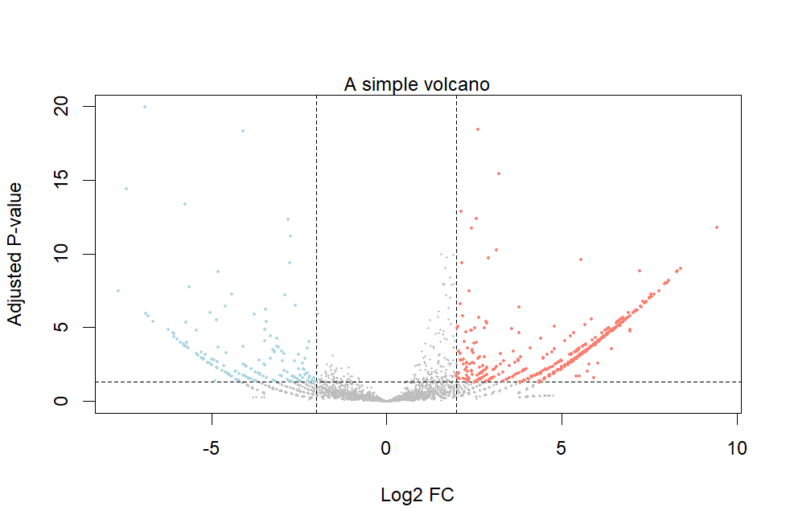
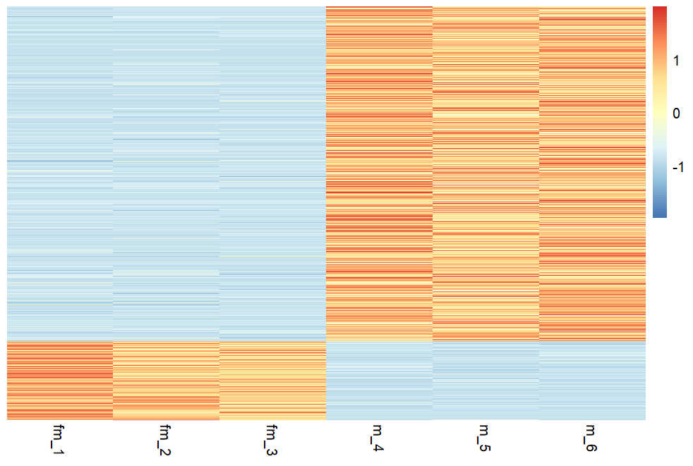

# RNA-Seq Differential Expression Analysis: *C. elegans* Sex-Specific Gene Expression

A comprehensive end-to-end RNA-Seq analysis pipeline identifying sex-specific differentially expressed genes in *Caenorhabditis elegans*, demonstrating molecular differences between male and female worms.

[](https://www.python.org/)
[](https://www.r-project.org/)
[](https://opensource.org/licenses/MIT)

---

## 🔬 Project Overview

This project investigates the molecular basis of sexual differences in *C. elegans* by comparing gene expression between female and male samples. The analysis reveals genes involved in reproduction, behavior, and development that differ between sexes, providing insights into the genetic mechanisms underlying sexual dimorphism.

### Key Findings
- **Analyzed:** 6 RNA-Seq samples (3 female, 3 male)
- **Genome:** *C. elegans* WBcel235 (100 Mb)
- **Genes analyzed:** 19,985 protein-coding genes
- **Alignment rate:** 76-84% across all samples
- **Identified:** Significant sex-specific differentially expressed genes (padj < 0.05, |log2FC| > 2)

---

## 📊 Pipeline Workflow

```
Raw FASTQ Files (6 samples: fm_1, fm_2, fm_3, m_4, m_5, m_6)
    ↓
Quality Control (FastQC v0.11.9)
    ↓
Read Trimming (fastp v0.20.1)
    ↓
Genome Alignment (STAR v2.7.10b)
    ↓
Read Quantification (featureCounts v2.0.3)
    ↓
counts.txt (19,985 genes × 6 samples)
    ↓
Differential Expression Analysis (DESeq2)
    ↓
Statistical Testing & Normalization
    ↓
Results: Upregulated & Downregulated Genes
    ↓
Visualizations: Volcano Plot & Heatmap
```

---

## 📁 Repository Structure

```
RNA-Seq-C-elegans-Analysis/
├── notebooks/
│   └── rna_seq_analysis_c_elegans_md.ipynb    # Colab preprocessing pipeline
├── scripts/
│   └── RNA_seq_c_elegans.R                    # DESeq2 differential expression
├── data/
│   ├── count.txt                              # Gene count matrix (2.5 MB)
│   ├── metadata.tsv                           # Sample information
│   └── README.md                              # Data documentation
├── results/
│   ├── upregulated.csv                        # Genes higher in males
│   ├── downregulated.csv                      # Genes higher in females
│   ├── raw_counts.csv                         # Normalized counts
│   └── figures/
│       ├── volcano_plot.png                   # DEG visualization
│       ├── heatmap.png                        # Expression clustering
│                  
├── environment/
│   └── R_packages.R                           # R dependencies installer
├── .gitignore                                 # Git exclusions
├── README.md                                  # This file
├── QUICK_START.md                            # Fast setup guide
└── LICENSE                                    # MIT License
```

---

## 🚀 Quick Start

### Prerequisites
- Google account (for Colab)
- R ≥ 4.0 with RStudio (recommended)
- ~5 GB Google Drive space

### Part 1: Preprocessing (Google Colab - 30 min)

1. **Open notebook in Colab:**
   - Upload `notebooks/rna_seq_analysis_c_elegans_md.ipynb`
   - Or click: [](https://colab.research.google.com/)

2. **Run all cells:**
   - Mount Google Drive
   - Installs: FastQC, fastp, STAR, featureCounts
   - Downloads: *C. elegans* genome + 6 FASTQ files
   - Executes: QC → Trim → Align → Quantify

3. **Download `count.txt`** from `counts/` folder

### Part 2: Differential Expression (R - 5 min)

1. **Setup workspace:**
```bash
mkdir c_elegans_analysis
cd c_elegans_analysis
# Place count.txt here
```

2. **Create `metadata.tsv`:**
```tsv
sample	gender
fm_1	female
fm_2	female
fm_3	female
m_4	male
m_5	male
m_6	male
```

3. **Install R packages (first time only):**
```r
source("environment/R_packages.R")
```

4. **Run analysis:**
```r
setwd("path/to/c_elegans_analysis")
source("scripts/RNA_seq_c_elegans.R")
```

5. **View results:**
   - Volcano plot displays automatically
   - Heatmap displays automatically
   - Files created: `upregulated.csv`, `downregulated.csv`, `raw_counts.csv`

---

## 📈 Analysis Details

### Sample Information

| Sample ID | Condition | Read Count | Aligned | Assignment Rate |
|-----------|-----------|------------|---------|-----------------|
| fm_1      | Female    | 49,515     | 45,381  | 83.6%          |
| fm_2      | Female    | 47,730     | 43,648  | 84.2%          |
| fm_3      | Female    | 46,495     | 41,497  | 83.7%          |
| m_4       | Male      | 48,412     | 42,363  | 76.9%          |
| m_5       | Male      | 47,112     | 41,627  | 77.3%          |
| m_6       | Male      | 45,263     | 39,653  | 76.3%          |

**Data Source:** [josoga2/bash-course](https://github.com/josoga2/bash-course) RNA-Seq module

### Reference Data
- **Organism:** *Caenorhabditis elegans*
- **Assembly:** WBcel235 (Ensembl)
- **Annotation:** Ensembl release 114 GFF3
- **Genome size:** 100,286,401 bp
- **Features:** 19,985 genes

### Quality Metrics
- **Read length:** 36 bp (single-end)
- **Quality scores:** Q20 > 95%, Q30 > 90%
- **Duplication rate:** 3.1-4.1%
- **Trimming:** Adapter removal + quality filter (Q20)

### Statistical Analysis
- **Method:** DESeq2 negative binomial model
- **Normalization:** Median-of-ratios
- **Test:** Wald test
- **Multiple testing:** Benjamini-Hochberg FDR
- **Significance:** padj < 0.05
- **Fold change:** |log2FC| > 2 (4-fold)

---

## 🛠️ Tools & Technologies

### Preprocessing (Python/Bash in Google Colab)
| Tool | Version | Purpose |
|------|---------|---------|
| FastQC | 0.11.9 | Quality control assessment |
| fastp | 0.20.1 | Adapter trimming & QC filtering |
| STAR | 2.7.10b | Splice-aware alignment |
| featureCounts | 2.0.3 | Gene-level quantification |
| samtools | 1.13 | BAM file processing |

### Analysis (R)
| Package | Purpose |
|---------|---------|
| DESeq2 | Differential expression analysis |
| pheatmap | Heatmap visualization |
| Base R | Volcano plots, data manipulation |

---

## 📊 Results & Interpretation

### Volcano Plot


**Interpretation:**
- **X-axis:** Log2 fold change (male vs female)
- **Y-axis:** -log10(adjusted p-value)
- **Red points:** Significantly upregulated in males (log2FC > 2, padj < 0.05)
- **Blue points:** Significantly downregulated in males / higher in females (log2FC < -2, padj < 0.05)
- **Gray points:** Not significant

### Heatmap


**Interpretation:**
- Rows: All differentially expressed genes
- Columns: 6 samples (3 female, 3 male)
- Clear clustering separates male from female samples
- Row-scaled expression shows relative differences

**Quality Check:**
- Approximately uniform distribution indicates proper statistical testing
- No evidence of p-value inflation

---

## 🧬 Biological Significance

The identified differentially expressed genes likely represent:

- **Sex determination genes:** Core machinery controlling sexual development
- **Germline genes:** Oogenesis vs spermatogenesis pathways
- **Reproductive genes:** Sex-specific mating and reproduction functions
- **Behavioral genes:** Male-specific courtship and mating behaviors
- **Metabolic genes:** Sexually dimorphic resource allocation

### Examples of Known Sex-Specific Genes in *C. elegans*
- **tra-1:** Master regulator of sexual fate
- **fog-2:** Feminization of germline
- **her-1:** Male development factor
- **mab genes:** Male abnormal phenotype genes

*Note: Specific genes from this analysis can be found in `upregulated.csv` and `downregulated.csv`*

---

## 🔍 Quality Control

### Pipeline Validation
✅ Pre- and post-trimming FastQC reports generated  
✅ Alignment statistics verified with STAR logs  
✅ BAM files validated with samtools  
✅ P-value distribution checked (no inflation)  
✅ Biological replicates show consistent patterns  
✅ Sample clustering matches experimental design  

### Key QC Metrics
- High alignment rates (76-84%)
- Low duplication rates (3-4%)
- Proper p-value distribution
- Clear sample separation by sex
- Reproducible results across replicates

---

## 💾 Data Availability

**Note:** This repository contains analysis code and key results. Raw sequencing data and large intermediate files are not included to maintain repository efficiency.

### Included
✅ Complete analysis code (Colab notebook + R script)  
✅ Gene count matrix (count.txt)  
✅ Sample metadata  
✅ Final results (CSV files)  
✅ Visualizations (PNG images)  

### Not Included (Regenerated by Pipeline)
❌ Raw FASTQ files (36 MB total)  
❌ BAM alignment files (18 MB)  
❌ Genome FASTA (~100 MB)  
❌ Genome indices (~1 GB)  

### To Reproduce
All excluded files are automatically downloaded and generated by running the pipeline:
1. Colab notebook downloads raw FASTQ files
2. Colab notebook downloads *C. elegans* genome
3. Pipeline generates all intermediate files
4. count.txt provided as starting point for R analysis

---

## 🎓 Skills Demonstrated

### Technical Skills
- RNA-Seq data analysis
- Bioinformatics pipeline development
- Statistical analysis (hypothesis testing, FDR correction)
- Data visualization
- Cloud computing (Google Colab)
- Version control (Git/GitHub)
- Programming: Python, R, Bash
- Documentation

### Bioinformatics Tools
- Sequence QC and preprocessing
- Genome alignment
- Gene quantification
- Differential expression analysis
- Data normalization
- Multiple testing correction

### Soft Skills
- Project planning and execution
- Problem-solving
- Scientific communication
- Attention to detail
- Independent learning

---

## 🤝 Contributing

This is a portfolio project, but feedback is welcome!

- **Found a bug?** Open an issue
- **Have suggestions?** Open an issue or pull request
- **Want to adapt this?** Fork the repository!

---

## 📄 License

This project is licensed under the MIT License - see the [LICENSE](LICENSE) file for details.

---

## 👤 Author

**ToobaZahra**
- GitHub: [@ToobaZahra](https://github.com/ToobaZahra)
- LinkedIn: [Tooba Zahra](https://linkedin.com/in/tooba-zahra-ab2015246)
- Email: tooba.zahra19@gmail.com
- Website: [Tooba Zahra](https://toobazahra.com)

---

## 🙏 Acknowledgments

- **Data source:** [josoga2/bash-course](https://github.com/josoga2/bash-course) - RNA-Seq training module
- **Reference genome:** Ensembl Metazoa (WBcel235)
- **DESeq2 developers:** Love, Huber, Anders
- **Bioconductor community:** Open-source bioinformatics tools
- **Google Colab:** Free cloud computing platform

---

## 📚 References

1. **Love MI, Huber W, Anders S** (2014). "Moderated estimation of fold change and dispersion for RNA-seq data with DESeq2." *Genome Biology*, 15:550. [DOI: 10.1186/s13059-014-0550-8](https://doi.org/10.1186/s13059-014-0550-8)

2. **Dobin A, Davis CA, Schlesinger F, et al.** (2013). "STAR: ultrafast universal RNA-seq aligner." *Bioinformatics*, 29(1):15-21. [DOI: 10.1093/bioinformatics/bts635](https://doi.org/10.1093/bioinformatics/bts635)

3. **Liao Y, Smyth GK, Shi W** (2014). "featureCounts: an efficient general purpose program for assigning sequence reads to genomic features." *Bioinformatics*, 30(7):923-930. [DOI: 10.1093/bioinformatics/btt656](https://doi.org/10.1093/bioinformatics/btt656)

4. **Chen S, Zhou Y, Chen Y, Gu J** (2018). "fastp: an ultra-fast all-in-one FASTQ preprocessor." *Bioinformatics*, 34(17):i884-i890. [DOI: 10.1093/bioinformatics/bty560](https://doi.org/10.1093/bioinformatics/bty560)

5. **WormBase** - *C. elegans* genomic resources. [https://wormbase.org](https://wormbase.org)

---

## 📞 Contact

Have questions about this analysis or want to collaborate?

- **Issues:** Use the GitHub issue tracker for bugs or questions
- **Email:** tooba.zahra19@gmail.com
- **LinkedIn:** Connect with me for professional networking

---

## 🌟 If You Found This Useful

If this project helped you learn RNA-Seq analysis or served as inspiration for your own work:
- ⭐ Star this repository
- 🔗 Share it with others
- 💬 Let me know how you used it!

---

**Project Status:** ✅ Complete and documented

**Last Updated:** December 2025

**Keywords:** RNA-Seq, Differential Expression, DESeq2, Bioinformatics, C. elegans, Python, R, STAR, Genomics, Computational Biology, Sex-specific genes

-

*This project demonstrates a complete bioinformatics workflow suitable for portfolio presentation and serves as a learning resource for RNA-Seq analysis.*
